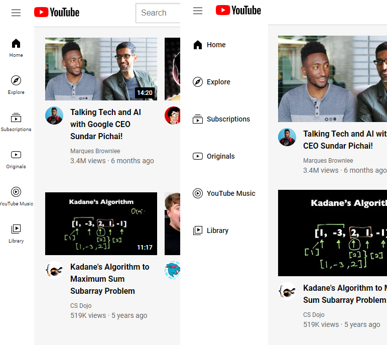

# HTML-CSS

Course: 
https://supersimple.dev/courses/html-css-course

Techniques I've Learned from this course:
1. Nested Layouts Technique
2. Display: block / inline-block
3. Grid
4. Flexbox
5. Position
6. Responsive design

Project preview after I've added responsive design to the Video Title and Stats, and to the Sidebar (challenge exercises 17a, 17b, and 17c):

